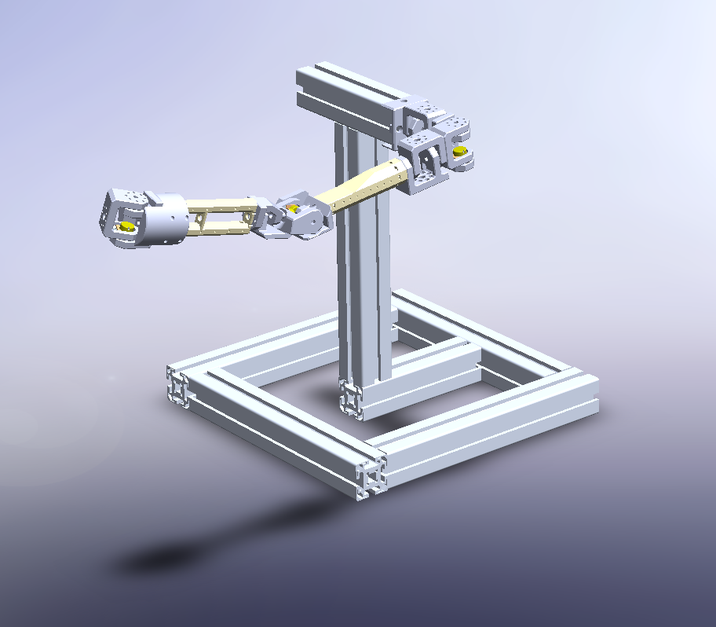
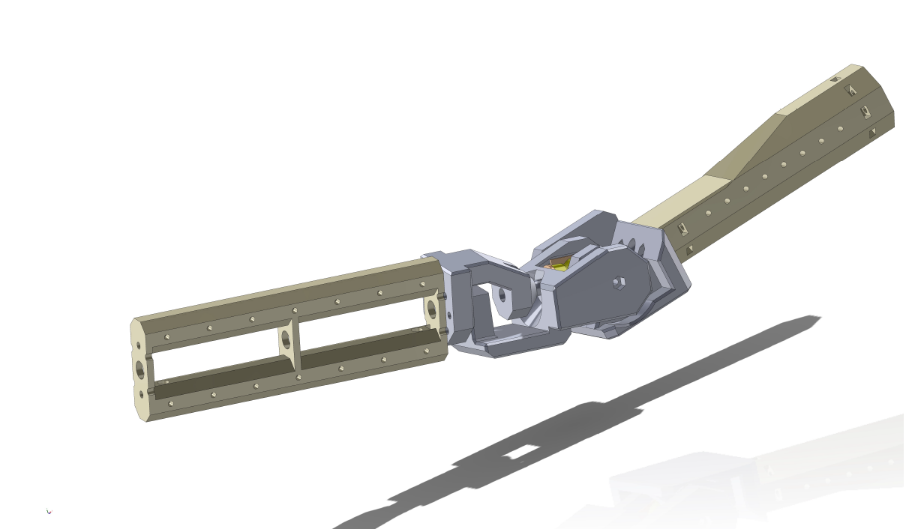
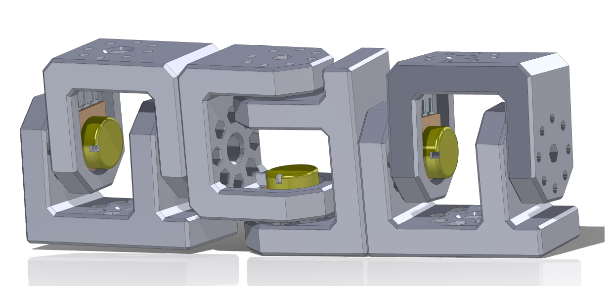
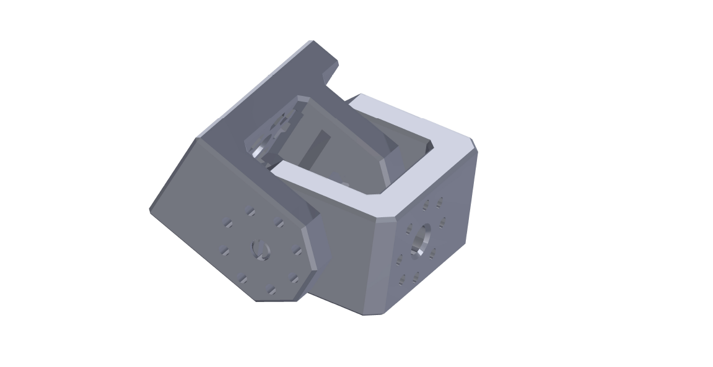

# Modular and sensorized dummy-arm

Desing of a sensorized dummy arm for human-robot interaction experiments.
The system icnludes a 3D printed arm with 10k linear rotary potentiometers and a DAQ based on a Arduino Mega which provides joint values at a rate of 100 Hz.
This repository includes both the STL for the arm components and the firmware dor the data acquisition system.

  

## Funding

This work is part of the project PID2021-127221OB-I00, funded by MICIU/AEI/10.13039/501100011033/FEDER, UE

  

